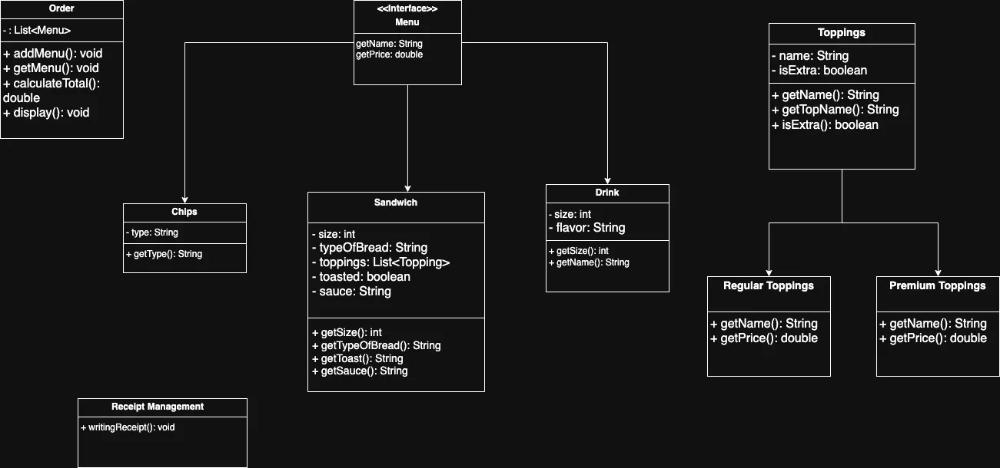

# Java Sandwich Ordering System

This is a Java-based console application for managing a sandwich ordering system. It allows users to build custom sandwiches, choose drinks and chips, and view a complete order summary with a receipt.

---

## 📌 Features

- Add multiple sandwiches to an order.
- Customize each sandwich with:
  - Type of bread
  - Regular and premium toppings
  - Toasted or not
  - Sauce
- Select drinks and chips
- Calculate total cost of the order
- Display and generate order summary
- **💲 Discount feature for customers with an account**
- **👥 Option to split the check among multiple customers**

---

## 🧱 Class Structure (UML)



---

## 📂 Project Structure

- `Menu` interface (base for all items)
- `Sandwich`, `Drink`, `Chips` (implementing `Menu`)
- `Toppings`, with subclasses `RegularToppings` and `PremiumToppings`
- `Order` class to manage complete orders
- `ReceiptManagement` to write receipt output
- `Customer` class to manage discounts
- Logic for splitting checks across multiple people

---

## 🛠️ How to Run

1. Compile the code:
   ```bash
   javac *.java
   ```

2. Run the main program:
   ```bash
   java Main
   ```

---

## 📄 Sample Output

```
*****Sandwich*****
Size: 8"
Bread: Wheat
Premium Topping: Bacon
Regular Toppings: Lettuce
Sauce: Mayo
Toasted: Yes

*****Drink*****
Size: 4"
Flavor: Coke

*****Chips*****
Type: BBQ

Here is your Total: $11.00
```

---

## 👨‍💻 Author

Yohannes Kassaye
