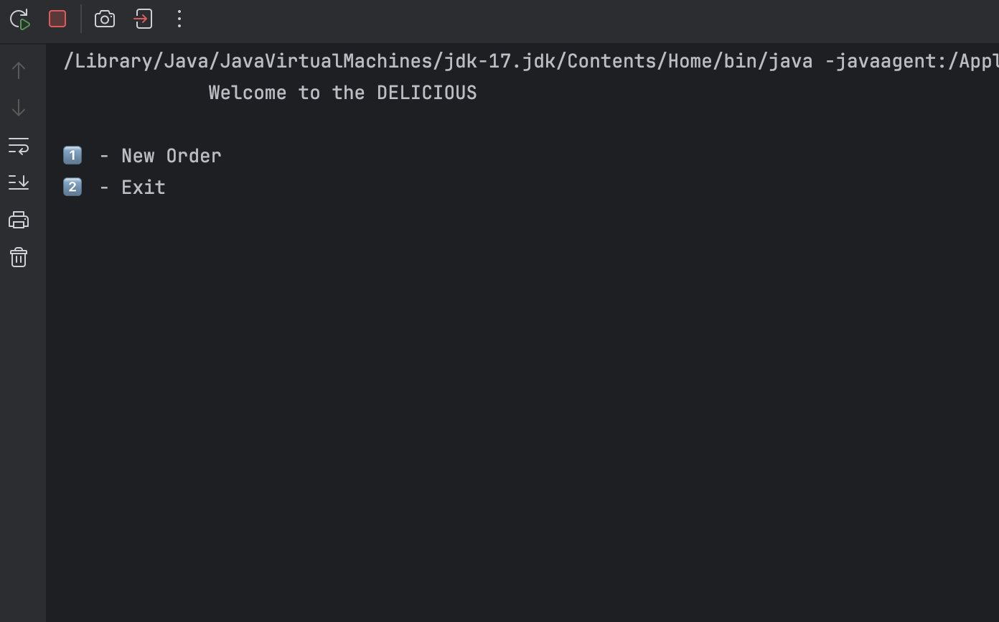
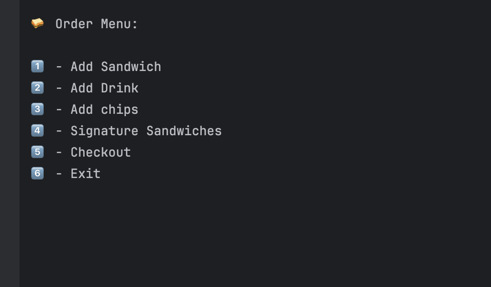
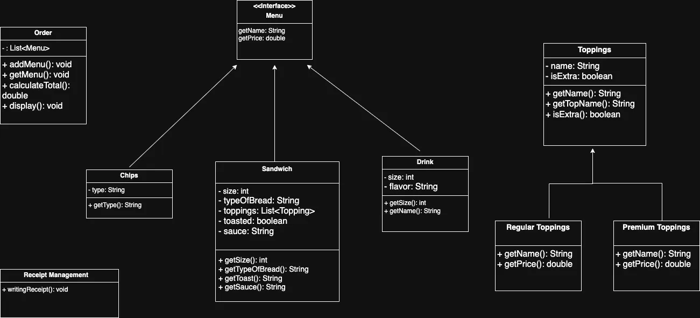
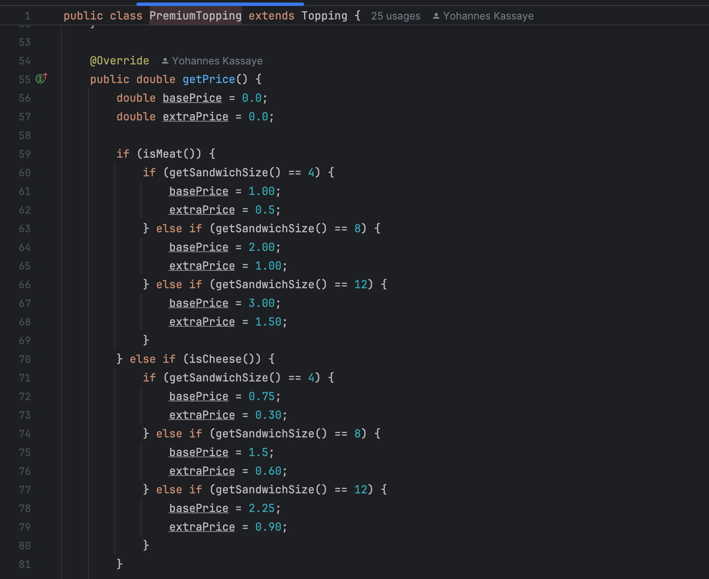
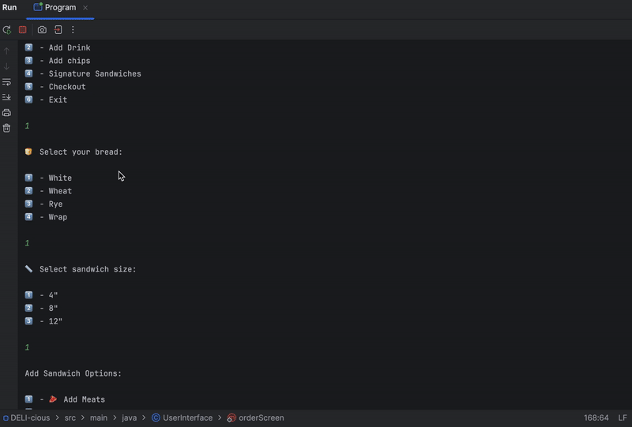

# DELI-cious

# Java Sandwich Ordering System

<details>
<summary>🛠 Technologies Used</summary>

- Java (console-based application)

</details>

<br>

<details>

<summary>🧠 Features</summary>

- Add multiple sandwiches to an order  
- Customize each sandwich with:
  - Type of bread
  - Regular and premium toppings
  - Toasted or not
  - Sauce  
- Select drinks and chips  
- **Account Holder Discount**: Apply automatic discount for customers with an account  
- **Split Check Option**: Split the bill between multiple people  
- Calculate total cost of the order  
- Display and generate order summary (receipt)

</details>

<br>

<details>
<summary>🏠 Home Screen</summary>

- **New Order**: Start building a new sandwich order  
- **Exit**: Close the application

<br>




</details>

<br>

<details>
<summary>📋 Order Menu</summary>

- Add multiple sandwiches to an order.
- Customize each sandwich with:
  - Type of bread
  - Regular and premium toppings
  - Toasted or not
  - Sauce
- Select drinks and chips
- Discount for customers with an account
- Split check option
- Calculate total cost of the order
- Display and generate order summary

<br>


</details>

<br>

<details>
<summary>💻 Application Interface</summary>

- Console-based menus for step-by-step order customization  
- Clear prompts guiding user interaction  
- Supports multiple orders and checkout management  
- Account status check for discount eligibility

</details>

<br>

<details>
<summary>📂 File Structure</summary>

- **Menu interface**: Base interface for all menu items  
- **Sandwich, Drink, Chips classes**: Implement Menu interface  
- **Toppings**: Includes RegularToppings and PremiumToppings subclasses  
- **Order class**: Manages all sandwiches, drinks, and sides in a single order  
- **ReceiptManagement**: Handles generating and writing receipt output  
- **Discount and Split Check**: Implemented as features in order processing  

</details>

<br>

<details>
<summary> 🧱 Class Structure (UML)</summary>



</details>

<br>

<details>
<summary> 🧱 Interesting code</summary>



</details>

<br>

<details open>
<summary>📸 Demo Preview</summary>

**🎞️ Live Demo (GIF)**  


</details>

## 🛠️ How to Run

1. Compile the code:
   ```bash
   javac *.java
   ```

2. Run the main program:
   ```bash
   java Main
   ```

---

## 📄 Sample Output

```
*****Sandwich*****
Size: Small
Bread: Wheat
Premium Topping: Bacon
Regular Toppings: Lettuce
Sauce: Mayo
Toasted: Yes
Price: $8.50

*****Drink*****
size: Small
Flavor: Coke

*****Chips*****
Type: Tortilla Chips

Here is your Total: $11.55
```

---

## 👨‍💻 Author

John Kassaye
